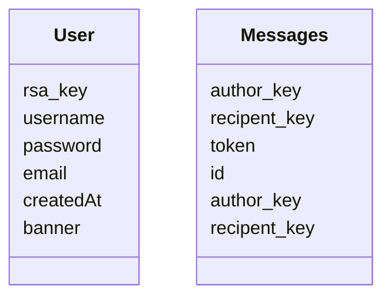
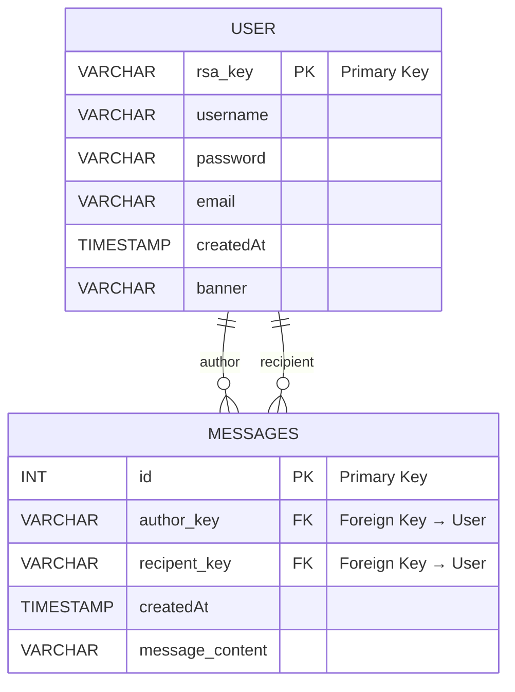

## Installation

### Requirements
- Docker
- mariadb client
- Cargo
- diesel_cli (installed via cargo : ``cargo install diesel_cli``)

### Steps
After you cloned the repository and installed all the dependencies, you will need to setup the .env from the .env-template

Finally can setup the docker using the following command: ``docker compose up -d``. This will start all the containers.

### Database
Database is managed by the diesel ORM .... (plus de docs à suivre ici)

Here is a basic schema of the database : 

And here a basic schema of the er Diagram databases :

## Running 
To run the project in development mode, simply run the command ``cargo run``
=======
## Repositories
This project is splitted in multiple repositories, each having it's own purpose : 
* [Plume](https://github.com/AmourDev77/Plume), this repositoy is the main palce for the relay, central piece of all the application where all the messages will be flowing
* [Plume_Core](https://github.com/AmourDev77/plume_core), core used in the cli and other future applications, it handles the encryptions, files generations and transactions parts for each messages sent to the server
* [Plume_Cli](https://github.com/AmourDev77/Plume-cli), our only client at the moment. Used for testing and fast development purpose. 
