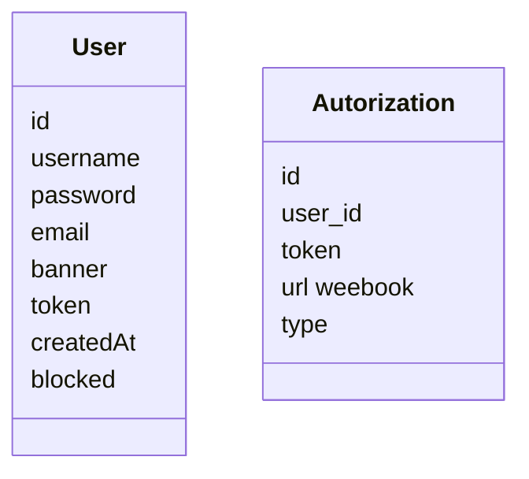

# Plume

## 📄 License

This project is licensed under the [CC BY-NC-SA 4.0 License](https://creativecommons.org/licenses/by-nc-sa/4.0/).  
Feel free to use, modify, and share it — as long as it's non-commercial and you keep the same license.

## Installation

### Requirements
- Docker
- mariadb client
- Cargo
- diesel_cli (installed via cargo : ``cargo install diesel_cli``)

### Steps
After you cloned the repository and installed all the dependencies, you will need to setup the .env from the .env-template

Finally can setup the docker using the following command: ``docker compose up -d``. This will start all the containers.

### Database
Database is managed by the diesel ORM .... (plus de docs à suivre ici)

Here is a basic schema of the database : 

## Running 
To run the project in development mode, simply run the command ``cargo run``
